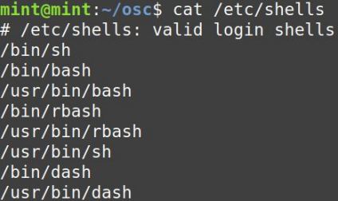
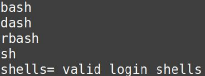
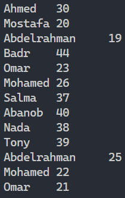
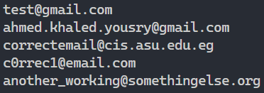
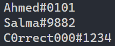
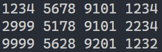
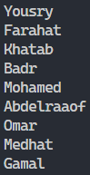

# Session 6: Text processing

## Task

**Note:** Some of the first examples are from the hands-on, to refresh your memory on the commands, but the others are new, so stick around till the end of the exercises 😇

### 1. Sort, Rev, Uniq, Cut, Tr
Get from the file ``/etc/shells`` on your linux system only the **uniq shells without their path, sort them and change the ':' in the line ``# /etc/shells:'' to an '='**

**/etc/shells** should look something similar to this:

**Output** should look like this:

### 2. Paste
You have 2 files, A file that contains names of people, and another that contains their ages, but they are seperated into 2 different files

Names file: [names](recources/names.txt)

Ages file: [ages](recources/ages.txt)

**I want you to horizontally merge them so that it looks like this**:

### 3. Grep (Global search for regular expressions and print out)
#### 1 - You have the following file that contains a bunch of email addresses (some are correct email addresses, and some are not)

[emails](recources/emails.txt)

I want you to create a **grep command** which searches and prints **only the email addresses which are in the correct form**

so the output of your grep command on this file should be the following:

#### 2 - You have the following file that contains a bunch of old discord user names

[discord](recources/discord.txt)

#### The old correct discord user names had to match the following pattern: Any_characters#any_exactly_4_digits
#### Ex: Ahmed#2348

I want you to create a **grep command** which searches and prints **only the discord usernames which are in the correct form**

so the output of your grep command on this file should be the following:

#### 3 - You have the following file that contains a bunch of credit card numbers

[cards](recources/cards.txt)

I want you to create a **grep command** which searches and prints **only those credit card numbers which have two or more consecutive occurences of the same digit (which may be separated by a space, if they are in different segments)**

If the credit card number is 1434 5678 9101 1234, there are two consecutive instances of 1 as highlighted in box brackets: 1434 5678 910[1] [1]234 
Here are some credit card numbers where consecutively repeated digits have been highlighted in box brackets. The last case does not have any repeated digits:

1234 5678 910[1][1]234 
2[9][9][9] 5178 9101 [2][2]34 
[9][9][9][9] 5628 920[1] [1]232 
8482 3678 9102 1232

so the output of your grep command on this file should be the following:

### 4. Sed (Stream editor)
#### You have the following file that contains a bunch of names, but it has some other things in it (comments and seperators)

[names with other things](recources/names_not_clean.txt)

I want you to create a **sed command that substitutes all the comments and seperators with blank lines, so that the file only has the names and some blank lines**

so the output of your sed command on this file should be the following:

### 5. Awk (The name is just the first letter of each of the 3 developers that worked on the tool "Awk" "If your just wondering 😅")

#### You have the following file that contains a bunch of names

[names](recources/names2.txt)

I want you to create an **awk command that gets the last name of each person and prints them, !!! without printing anything other than the names**

so the output of your awk command on this file should be the following:

